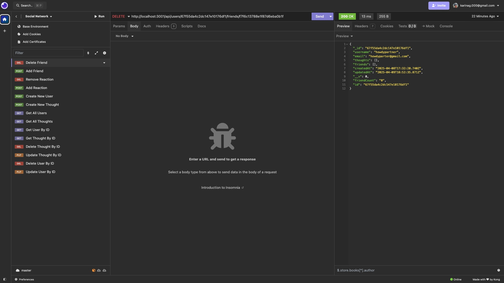

# Social_Network_APpp

## Description
This is a sample backend using MongoDB for a thoughts social network. The thoughts social network is made up of users. Users, have thoughts and within those thoughts, users can react. This is somewhat of a simple demonstration of how MongoDB can be used. The motivation was to understand a bit more of what could be done with the software. It is a little more free form than traditional SQL, but you can force structure with mongoose.

## Installation
Clone the repository and run npm run start. The command will build the software and then run the server using express.

## Usage

This application is primarily backend, so the usage is via a demonstration of the program in Insomnia. 

## Walkthrough Video
Click here to watch the walkthrough video
(Replace with your deployed video link)

## Screenshot

Credits
Author: Karina Garcia
GitHub: karinuhgarcia

License
MIT
